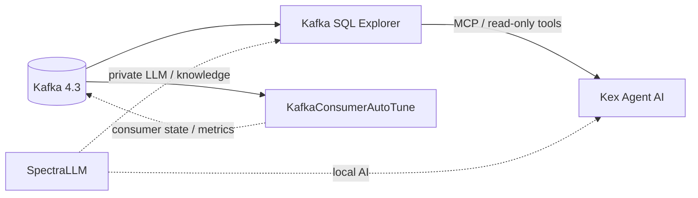

# Kex Lab

**One lab to understand, run and evaluate the Kex ecosystem.**

Kex Lab is the integration and evaluation repository for four complementary projects:

| Project | Role |
|---|---|
| [Kex Agent AI](https://github.com/devdownin/Kex-agent-ai) | Governed AI agent, MCP orchestration, supervision and human approval |
| [Kafka SQL Explorer](https://github.com/devdownin/Kafkaexplorer) | Inspect, query, trace and audit Kafka; exposes read-only MCP tools |
| [KafkaConsumerAutoTune](https://github.com/devdownin/kafkaconsumerautotune) | Adaptive Kafka consumer using PID-based tuning, resilience and observability |
| [SpectraLLM](https://github.com/devdownin/SpectraLLM) | Private local RAG, document ingestion, fine-tuning and local LLM serving |

Kex Lab does not merge those products. It provides the glue needed to evaluate them together and independently.

## Architecture



## 5-minute start

Requirements: Docker Engine with Compose v2.

```bash
cp .env.example .env
make doctor
make up
make status
make smoke
```

Open Kafka SQL Explorer at **http://localhost:8080** and Kex Agent AI at **http://localhost:8081**.

Set a model API key in `.env` before using agent chat. Infrastructure and Explorer can be evaluated without one.

```bash
make down
make reset   # also removes volumes
```

## Evaluation paths

**Core (recommended first):** one Kafka broker + Explorer + Kex Agent, wired through MCP.

```bash
make up
make smoke
```

**Individual products:** `make components` clones the upstream repositories under `.components/`. Then run `./scripts/evaluate.sh <component>`. Heavy product-specific stacks remain owned by their upstream projects instead of being copied here and drifting.

See [docs/EVALUATION.md](docs/EVALUATION.md) for the evaluation paths, [docs/END-TO-END.md](docs/END-TO-END.md) for the integrated traffic-to-diagnosis demo, and [docs/ARCHITECTURE.md](docs/ARCHITECTURE.md) for integration principles.

## End-to-end demo

Add KafkaConsumerAutoTune and deterministic traffic to the core stack:

```bash
make demo
```

This produces records to `demo.app.topic`, lets AutoTune consume/adapt, exposes the same broker through Explorer, and gives Kex Agent an MCP evidence path for diagnosis. See [docs/END-TO-END.md](docs/END-TO-END.md).

Reproducible scenarios:

```bash
make demo-basic
make demo-lag
make demo-dlt
make demo-overload
make report
```

Optional cross-project observability:

```bash
make observability-up
# Prometheus: http://localhost:9090
# Grafana:    http://localhost:3000
```

Image versions are centralized in `versions.env`. Integration boundaries are documented in [docs/CONTRACTS.md](docs/CONTRACTS.md). The evidence checklist is in [docs/SCORECARD.md](docs/SCORECARD.md).

## Docker Hub-only profile

Run all four Kex applications from their published images, without cloning or building application sources:

```bash
cp .env.example .env
make doctor
make hub-up
make hub-status
```

The profile pulls Kafka Explorer, Kex Agent AI, KafkaConsumerAutoTune, SpectraLLM and the Spectra frontend from the image catalog in `versions.env`. Spectra is connected to the same Kafka broker and subscribes to `demo.app.topic`.

Endpoints:

- Explorer: http://localhost:8080
- Kex Agent: http://localhost:8081
- AutoTune: http://localhost:8082/dashboard
- Spectra: http://localhost:8084
- Spectra API: http://localhost:8083

Spectra still needs its model artifacts. With `SPECTRA_STARTUP_AUTO_INSTALL_MODELS=true`, its API may download the default models on first startup; this is independent from building the application images.

Stop with `make hub-down`.

## Principles

- Published images first for fast evaluation.
- One shared Kafka in the core Lab stack.
- Upstream ownership of product-specific infrastructure.
- Loopback binding by default.
- Smoke checks report failures instead of masking unavailable capabilities.
- The Lab is resettable without touching source repositories.

## Layout

```text
.
├── compose.yml
├── .env.example
├── Makefile
├── scripts/
│   ├── components.sh
│   ├── status.sh
│   ├── smoke-test.sh
│   └── evaluate.sh
└── docs/
    ├── ARCHITECTURE.md
    └── EVALUATION.md
```

## Licenses

Each upstream project keeps its own license. Consult the corresponding repository before redistribution or modification.
