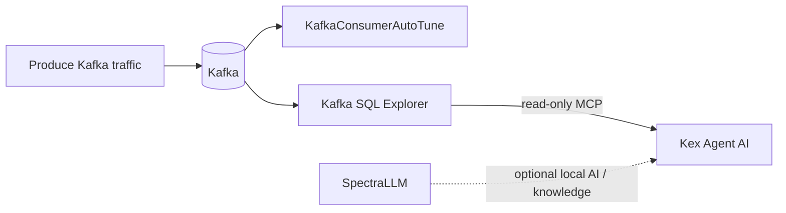
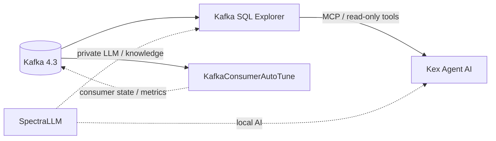

<div align="center">

# Kex Lab

### AI-assisted Kafka operations — observable, adaptive, local.

**Run and evaluate the complete Kex stack on your machine.**

[](https://www.docker.com/)
[](https://kafka.apache.org/)
[](https://modelcontextprotocol.io/)
[](https://github.com/devdownin/Kex-Lab)

**OBSERVE** Kafka · **ADAPT** consumers · **DIAGNOSE** with AI · **KEEP KNOWLEDGE LOCAL**

</div>

---

<table>
<tr>
<td width="25%" align="center"><strong>🔎 OBSERVE</strong><br><sub>Kafka SQL Explorer</sub><br><br>Inspect, query, trace and audit Kafka</td>
<td width="25%" align="center"><strong>⚙️ ADAPT</strong><br><sub>KafkaConsumerAutoTune</sub><br><br>Adapt consumer settings to Kafka traffic</td>
<td width="25%" align="center"><strong>🤖 DIAGNOSE</strong><br><sub>Kex Agent AI</sub><br><br>Use read-only Kafka evidence through MCP</td>
<td width="25%" align="center"><strong>🧠 KNOWLEDGE</strong><br><sub>SpectraLLM</sub><br><br>Optional private local AI and RAG</td>
</tr>
</table>

Kex Lab connects four open-source projects around one Kafka broker so developers and platform teams can evaluate Kafka inspection, adaptive consumption, AI-assisted diagnosis and optional local AI capabilities in one reproducible environment.



### From events to insights

The integrated demo produces Kafka traffic, lets **KafkaConsumerAutoTune** consume and adapt, exposes the broker through **Kafka SQL Explorer**, and gives **Kex Agent AI** a read-only MCP path for assisted diagnosis. **SpectraLLM** adds optional local AI and knowledge capabilities.

Kex Lab is an integration and evaluation repository. The four products remain independent projects.

## 🚀 Start here

> **Goal:** get the published Kex applications running together around a shared Kafka broker.

**Requirement:** Docker Engine with Compose v2.

### Complete stack · Docker images

No application source build is required. Kex Lab uses the published Docker Hub images for the four projects (five application images because SpectraLLM has separate backend and frontend images).

```bash
cp .env.example .env
make doctor
make hub-up
make hub-status
```

Open:

- Kafka SQL Explorer: **http://localhost:8080**
- Kex Agent AI: **http://localhost:8081**
- KafkaConsumerAutoTune: **http://localhost:8082/dashboard**
- SpectraLLM: **http://localhost:8084**

SpectraLLM still needs its model artifacts. With `SPECTRA_STARTUP_AUTO_INSTALL_MODELS=true`, its API may download the default models on first startup. Kex Agent chat requires a configured model provider/API key.

Stop the complete stack with `make hub-down`.

### ⚡ See the Kafka scenario in action

```bash
make demo-basic
```

Additional reproducible scenarios:

```bash
make demo-lag
make demo-dlt
make demo-overload
make report
```

### 📦 Prefer a smaller starting point?

For Kafka + Explorer + Kex Agent:

```bash
cp .env.example .env
make doctor
make up
make status
make smoke
```

Stop with `make down`, or use `make reset` to also remove volumes.

## 🧩 Explore the stack

| Project | What it contributes to the Lab |
|---|---|
| [Kex Agent AI](https://github.com/devdownin/Kex-agent-ai) | Uses governed actions, supervision and human approval; accesses Kafka evidence through Explorer's MCP tools |
| [Kafka SQL Explorer](https://github.com/devdownin/Kafkaexplorer) | Inspects, queries, traces and audits Kafka; exposes read-only MCP tools |
| [KafkaConsumerAutoTune](https://github.com/devdownin/kafkaconsumerautotune) | Consumes Kafka traffic and adapts consumer settings using PID-based tuning, with resilience and observability |
| [SpectraLLM](https://github.com/devdownin/SpectraLLM) | Provides optional private local RAG, document ingestion, fine-tuning and local LLM serving |

## 🏗️ How it connects



## 📊 Evaluate with evidence

Individual products can also be evaluated from their upstream repositories. `make components` clones them under `.components/`; then run `sh scripts/evaluate.sh <component>`.

For the integrated Lab, optional cross-project observability is available with:

```bash
make observability-up
# Prometheus: http://localhost:9090
# Grafana:    http://localhost:3000
```

Image versions are centralized in `versions.env`. See [docs/EVALUATION.md](docs/EVALUATION.md) for evaluation paths, [docs/END-TO-END.md](docs/END-TO-END.md) for the traffic-to-diagnosis demo, [docs/ARCHITECTURE.md](docs/ARCHITECTURE.md) for architecture, [docs/CONTRACTS.md](docs/CONTRACTS.md) for integration boundaries and [docs/SCORECARD.md](docs/SCORECARD.md) for the evidence checklist.

## 🔒 Principles

- Published images first for fast evaluation.
- One shared Kafka in the core Lab stack.
- Upstream ownership of product-specific infrastructure.
- Loopback binding by default.
- Smoke checks report failures instead of masking unavailable capabilities.
- The Lab is resettable without touching source repositories.

## 📁 Repository layout

```text
.
├── compose.yml
├── .env.example
├── Makefile
├── scripts/
│   ├── components.sh
│   ├── status.sh
│   ├── smoke-test.sh
│   └── evaluate.sh
└── docs/
    ├── ARCHITECTURE.md
    └── EVALUATION.md
```

## 📄 Licenses

Each upstream project keeps its own license. Consult the corresponding repository before redistribution or modification.
