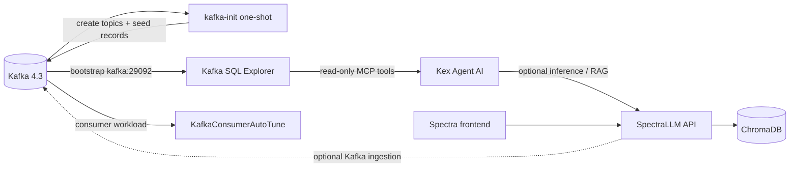
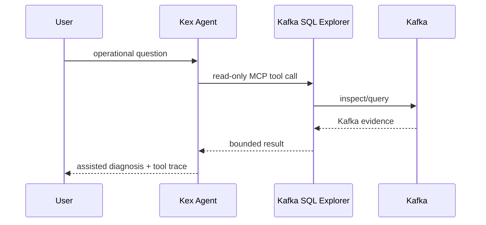

# Kex Lab architecture

## Purpose

Kex Lab is an integration boundary, not a monorepo. Each product remains independently releasable and keeps its own runtime, tests and license.

## Runtime topology

| Boundary | Contract |
|---|---|
| kafka-init → Kafka | Creates the application/DLT topics and injects deterministic seed records before dependent services start |
| Explorer → Kafka | Inspection/query access to the shared broker |
| AutoTune → Kafka | Consumer workload and consumer-group state |
| Agent → Explorer | Read-only MCP tools; Kafka evidence remains bounded by Explorer |
| Optional operational reviews | Explorer checks operator-defined `lab` topic policy and declared DLT source; lag samples persist under `/app/data/mcp-lag-history` with the optional Compose overlay |
| Agent → Spectra | Optional local model/knowledge path when configured |
| Spectra → Kafka | Optional ingestion of configured topics |

The shared Docker network makes services reachable by name, but network reachability is not treated as authorization. In particular, the Agent's intended Kafka evidence path remains Explorer's read-only MCP boundary.

The optional [operational review profile](OPERATIONAL-REVIEWS.md) adds one
named Explorer state volume. It retains lag baselines across container restarts
on one Docker host; deployments with several Explorer instances require a shared
writable filesystem with interprocess locks. A declared DLT source is not proof
of forwarding, monitoring or replay. Topic policy thresholds belong to the
Lab's single broker and are not production defaults.

## Capability map

| Layer | Project | Responsibility |
|---|---|---|
| Event backbone | Kafka | Shared event stream used as the reference integration |
| Evidence and exploration | Kafka SQL Explorer | Topics, SQL, schemas, tracing, audits and read-only MCP |
| Adaptive execution | KafkaConsumerAutoTune | Consumer throughput adaptation, resilience and observability |
| Governed reasoning | Kex Agent AI | Tool selection, supervision, policy, approvals and audit |
| Private AI knowledge | SpectraLLM | Local RAG, ingestion, fine-tuning and model deployment |

## Diagnosis path

## Kafka initialization lifecycle

`kafka-init` is a one-shot service built from the same Kafka image as the broker tooling. It starts only after Kafka is healthy, mounts `scripts/kafka-init.sh`, creates `KEX_LAB_TOPIC` and `KEX_LAB_DLT_TOPIC` with `--if-not-exists`, and writes `KEX_LAB_MESSAGES` deterministic records.

Topic creation is idempotent. Data seeding is intentionally repeatable: rerunning the initializer adds another configured batch rather than deleting existing data. Explorer and other Kafka-dependent services use `service_completed_successfully` where initialization must precede startup.

The same script is reused by the `traffic` service and the backward-compatible end-to-end producer entrypoint, preventing separate topic/seed implementations from drifting.

## Demo path

`make demo` is the shortest integrated path. It validates Docker, starts the published Docker Hub images, waits for readiness, injects the basic scenario and prints the Lab health view and application entry points.

Use `make demo-lag`, `make demo-dlt` and `make demo-overload` for deliberately stressed scenarios. These are evaluation scenarios, not production workload models.

## Deployment profiles

The core Compose remains useful for a smaller Kafka + Explorer + Agent evaluation. The Docker Hub path layers AutoTune and Spectra on top using published images. Observability remains an optional Compose overlay so the default demo does not require Prometheus and Grafana.

Image versions are centralized in `versions.env`; environment-specific configuration belongs in `.env`.
