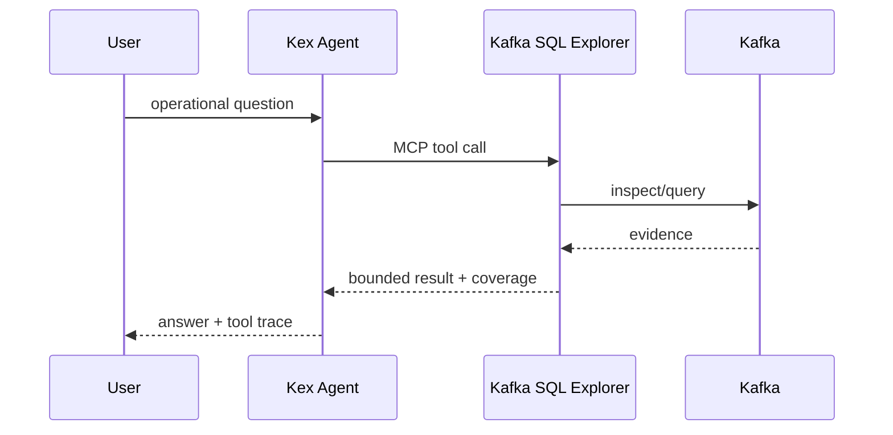

# Kex Lab architecture

## Purpose

Kex Lab is an integration boundary, not a monorepo. Each product remains independently releasable and keeps its own runtime, tests and license.

## Capability map

| Layer | Project | Responsibility |
|---|---|---|
| Event backbone | Kafka | Shared event stream used as the reference integration |
| Evidence and exploration | Kafka SQL Explorer | Topics, SQL, schemas, tracing, audits and read-only MCP |
| Adaptive execution | KafkaConsumerAutoTune | Consumer throughput adaptation, resilience and observability |
| Governed reasoning | Kex Agent AI | Tool selection, supervision, policy, approvals and audit |
| Private AI knowledge | SpectraLLM | Local RAG, ingestion, fine-tuning and model deployment |

## Core integration

The Lab core deliberately reuses Explorer's read-only MCP boundary. The agent does not receive direct Kafka mutation rights merely because it shares a network with the broker.

## Why AutoTune and Spectra are not forced into the core Compose

AutoTune's maintained demo includes Oracle, Prometheus, OpenTelemetry, Jaeger, Grafana and Loki. SpectraLLM has a multi-service local AI stack and downloads several GB of model weights. Duplicating those definitions here would create configuration drift and make the first evaluation unnecessarily heavy.

Kex Lab therefore has two levels:

1. **Core Compose** — fast integration path: Kafka + Explorer + Agent.
2. **Upstream scenarios** — scripts clone and launch the maintained AutoTune and Spectra stacks when those capabilities are being evaluated.

A later end-to-end scenario can add adapters only where there is a stable contract worth testing; it should not copy whole upstream Compose files.
